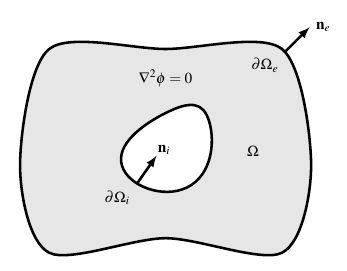
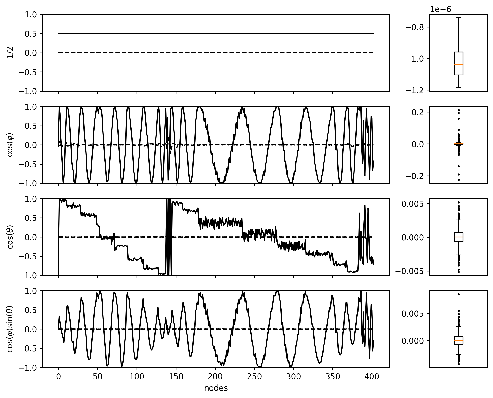
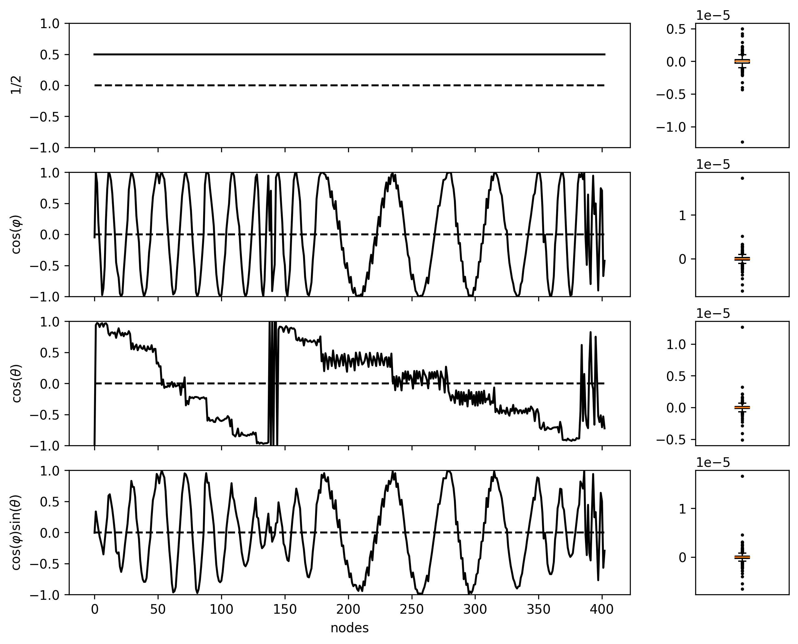
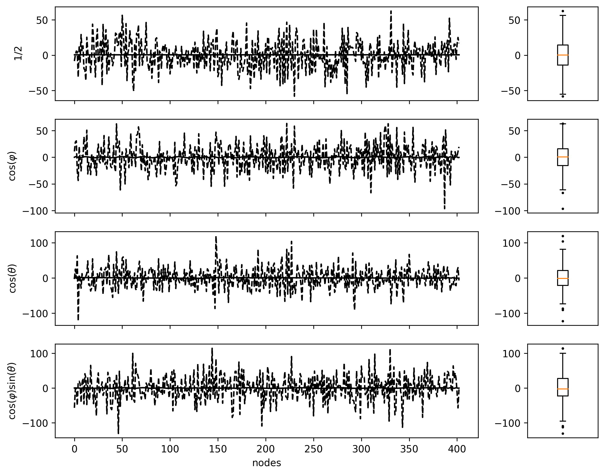
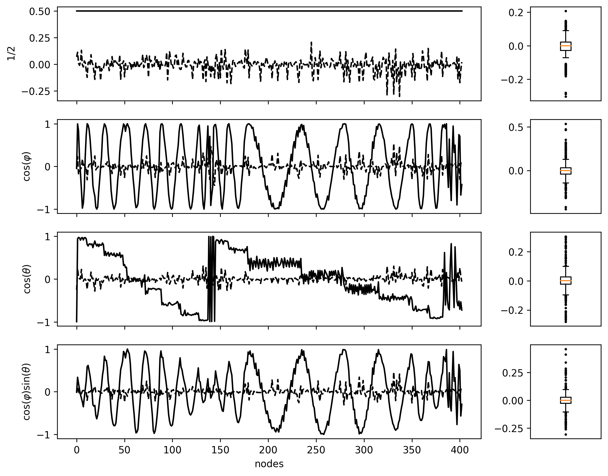

# ECGI (ElectroCardioGraphic Imaging) Model

A BEM (Boundary Element Method) solver of the Laplace problem with Cauchy boundary conditions: 

\
$$ \nabla^2 \phi(\mathbf{r}) = 0 \quad \mathbf{r}\in \Omega $$

$$ \phi(\mathbf{r}) = \phi_e \quad \mathbf{r}\in \partial\Omega_e $$

$$ \frac{\partial \phi}{\partial \mathbf{n}}(\mathbf{r}) = 0 \quad \mathbf{r}\in \partial\Omega_e $$

where the domain is a hollow volumen like this:



the model requires two meshes as input. The inner and outer meshes must be closed and outpointing normal surfaces.

The implementation depends on [bempp](https://bempp.com/) and  has a `solve()` method requiring a square system, i.e., inner and outer meshes with same amount of nodes. Otherwise, `get_transfer_matrices()` is preferred in order to apply any regularization because the problem is ill-posed.

## Usage

```python
from ecgi_model import EcgiModel

outer_mesh = (
    outer_vertices, # numpy.ndarray [No x 3],
    outer_triangles, # numpy.ndarray [Mo x 3],
)

inner_mesh = (
    inner_vertices, # numpy.ndarray [Ni x 3],
    inner_triangles, # numpy.ndarray [Mi x 3],
)

ecgi_model = EcgiModel(outer_mesh, inner_mesh, discretization='node') # you can choose between 'node' and 'triangle' discretizations.
A, B = model.get_transfer_matrices()

# solve using regularization ..
# if Ni and No are equal, just use model.solve(y)
```

## **Examples**

Let two concentric spherical meshes of radius 1 and .5 with same amount of vertices. Let $u_1 = 1/2$, $u_2 = \cos(φ)$, $u_3 = \cos(θ)$ and $u_4 = \cos(φ)\sin(θ)$ *a priori* solutions. The potential on the outer mesh is $y_i = A u_i $.

Solving the square case with GMRES we get,



where solid line is $u_i$ and dashed line is the estimation error $\hat{u}_i - u_i$. On the right panel, the boxplots represent the estimation error too.

In the case of ridge regularization, the errors are enhanced,




### Instability

In order to show the instability effect, we add a very small error on $y_i$ and recompute with GMRES,



where estimation error is brutally increased. However, by applying ridge regularization an acceptable solution is obtained.


